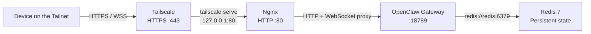

<p align="center">
  
</p>

<p align="center">
  <strong>Local AI stack for ARM and x86 environments</strong>
</p>

<p align="center">
  <a href="#-quick-start">Quick Start</a> •
  <a href="#-architecture">Architecture</a> •
  <a href="#-documentation">Docs</a>
</p>

<p align="center">
  
  
  
  
  

</p>

---

# ✨ Sprout?... What is that?

**Sprout** is a free, open-source, lightweight deployment toolkit for Local AI. Set up your environment quickly and safely.

Built on a **modular, plug-and-play architecture**, Sprout enables one-command deployment of Local AI stacks on ARM and x86 devices. Install OpenClaw, Ollama, Open WebUI and other Docker-based services through configuration instead of complex provisioning, creating a lightweight, extensible platform ready for edge computing, homelabs and self-hosted AI.

|                                      |                                                                        |
| ------------------------------------ | ---------------------------------------------------------------------- |
| 🔓 **100% Open Source**              | No licensing fees, no feature locks, full source code access           |
| 🐳 **Docker Native**                 | Ready to use with zero configuration                                   |
| 🧩 **Official Components**           | Only official images for security and realiability                     |
| 🏎 **Lightweight and Optimized**     | Configured to operate with minimal resources in a personal environment |

ℹ️ **Release status:**

First public **beta** release of Sprout.

This version provides a portable environment for ARM and x86 platforms. It is intended for evaluation, testing, and early adopters.

---
# 🚀 Quick Start

Sprout bootstraps a complete local OpenClaw environment in just a few minutes.

It generates a ready-to-run Docker Compose stack including:

- OpenClaw
- Redis
- Nginx
- Tailscale

No manual Docker Compose editing is required.

---

### Supported platforms

Sprout has been designed for both ARM and x86 architectures.

| Platform | Status |
|----------|--------|
| Raspberry Pi 4 (4 GB+) | ✅ Recommended |
| Raspberry Pi 5 | ✅ Recommended |
| Intel NUC | ✅ Supported |
| Mini PC (Intel/AMD) | ✅ Supported |
| macOS (Apple Silicon) | ✅ Supported |
| macOS (Intel) | ✅ Supported |
| WSL2 | ✅ Supported |

---

### Minimum hardware

Recommended minimum:

- 4 CPU cores
- 4 GB RAM
- 10 GB free disk space

Recommended for LLM usage:

- 8 GB RAM or more
- SSD storage

---

### ⚠️ Software requirements

#### Docker Engine

Docker Compose v2 is required.

Verify installation:

```bash
docker --version
docker compose version
```

---

#### Git

```bash
git --version
```

---

#### Bash

Sprout requires Bash.

Linux and macOS already include it.

---

#### Tailscale account

Create a free account:

https://tailscale.com

Generate an Auth Key from:

https://login.tailscale.com/admin/settings/keys

---

#### AI Provider

OpenClaw requires at least one AI provider.

By default, Sprout automatically provisions the Bootstrap Module published by the Garden. The default bootstrap downloads and installs the local inference Runtime (`ollama`) together with the default bootstrap model (`tinyllama`), so no external AI provider is required.

Alternatively, you may configure one or more frontier providers such as OpenAI or Anthropic by supplying their API keys.

Remember: before starting the Runtime, configure either:

- a local Bootstrap Module (provisioned automatically), or
- at least one frontier provider API key.

---

### Installation

Clone the repository.

```bash
git clone https://github.com/paalbarr/sprout.git
cd sprout
```

Make the script executable.

```bash
chmod +x install.sh
./install.sh
```

---

### Configure and launch
Generate the stack and configure bootstrap model.

```bash
./sprout start
```

Sprout will automatically:

- Pull Docker images
- Start all containers
- Wait for Tailscale registration
- Configure `tailscale serve`
- Display the public Tailnet URL

This creates:

```text
agents/
├── openclaw agents configurated
conf/
├── openclaw.json
stack/
├── intallation files and dirs
workspace/
├── shared files for openclaw
```

---

### Connect

Open the URL shown by `./sprout start` in the configuration process.

Use:

```
WebSocket URL: wss://<your-fqdn>/
Token: <OPENCLAW_GATEWAY_TOKEN>
```

Leave **Password** empty.

---

### Approve the device

The first browser connection requires approval.

```bash
./sprout auth <UUID-shown-by-the-dashboard>
```

Reconnect the browser.

You're ready to use OpenClaw. 😎

---

### Next steps

Your local OpenClaw instance is now running securely behind Tailscale.

You can now:

- Connect AI providers
- Pair additional devices
- Deploy local agents
- Extend the Docker Compose stack

---

# 🎯 Architecture

Sprout generates an isolated Docker network with OpenClaw, Redis, Nginx, and
Tailscale. Tailscale is the only tailnet-facing entry point; Nginx and OpenClaw
remain internal to the Compose stack.

### Runtime model



See [ARCHITECTURE.md](./ARCHITECTURE.md) for specifics details about network
model, generated directory tree, persistent data, and configuration inputs.

---

## 📚 Documentation

- [Daily commands and troubleshooting](./HOWTO.md)
- [Architecture model explained](./ARCHITECTURE.md)
- [Architecture specs](./SPECS.md)
- [Development coding standards](./DEVELOPMENT.md)

---

## 📄 License

This project is licensed under the **Apache 2.0** - free for personal and commercial use.

See [LICENSE](./LICENSE) for details.
